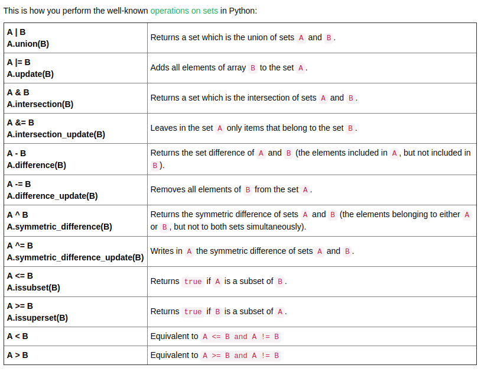

# Python-modules

I will try to include all the possible shortcuts and other stuff here. 

**Arithmetic operations:**

`+ , - , *, /` are literally addition,subtraction, multiplication,division. and `a**b` means `a^b` (a to the power b) and `a//b` means the integer division of `a/b`


**string input:** `s = input()`

**int input:** `a = int(input())`

**float input:** `a = float(input())`
 
2 or 3 integer inputs __inline__ :

```python
a,b,c = map(int,input().split())
a,b,c = map(float,input().split())
```
**Conditional Logic:**

```python
if(statement):
	#this is inside if() condition
	#this is also inside if() condition
	#this is also inside if() condition
elif(another_statement):
	#this is inside elif() condition
	#this is inside elif() condition
else:
	#this is inside the else condition
	#do whatever you want to do.. 

#now we will see some conditional operators 

#conditional and operators
a = 3
b = 3
if(a == b and a+b == 6):
	print("Hello")
# it will print "Hello"

#conditional or operator

a = 4
b = 2
if(a+b == 6 or a==b):
	print("Hello")
#it will print "Hello"

```


**Loops:**


```python
#for loop...
for i in range(x,y):
	#do whatever you want
	# i will iterate from x to y-1
	# all lines indented here will be inside the for loop
# while loop

i = 0
while(i <= 10):
	print(i) # It will print from 0 to 10. So try to undarstand what's happening
```


**Different methods to work with Array/Lists:**

```python
#### array input-output showing

#method number 1(easy)
ara = list(map(int,input().split()))
print(len(ara)) # array ibdexes from 0 to len-1
print(ara) # printing the full array
print(ara[some_index]) #printing a particular index 
ara[some_index] = some_value # changing value at some index... same as C/C++

#method number 2(you have to know the size of the array before taking the input):
ara = []
length = int(input()) #taking the length of input
for i in range(length): # simply loop over the length and insert the values one by one
	ara.append(int(input()))

print(ara) # printing the full array
print(ara[some_index]) #printing a particular index 
ara[some_index] = some_value # changing value at some index... same as C/C++

# Removing a particular "value" from an array or string
ara.remove(value) # just like this

# taking the substring from an array or string

#suppose...
ara = [2, 3, 5, 1, 4, 3]
ara2 = ara[1:4]
#here ara2 = [3,4,5,4] . because we just took from 1th index to 4th index.
#array indexing starts from 0
#we can do it in another approach

ara = [2, 3, 5, 1, 4, 3]
ara2 = list()
for i in range(1,5):
	ara2.append(ara[i])
print(ara2) #here ara2 has the sbstring from 1th index to 4th index

```

**String:**

```python

a = input() #taken the input of a string
print(len(a)) #length of string a

b = input() #another string input
print(len(b)) #printing the length of a 

c = a+b #adding the string. if a = "Hello" and b = "world" then c = "Helloworld"
d = a*3 #if a = "Hello" then d = "HelloHelloHello"

s = a[2:5] #taken a substring of a from 2th index to 5th index

```

**2D array:**
```python
#here is an example of 2d array with size n*m
#initializing the "matrix" array first. 

matrix = []
n = 2
m = 3

for i in range(0,n):
    matrix.append([])
    for j in range(0,m):
        matrix[i].append(0)

#initialization completed
#Now we will take the input and append the matrix just like this:
ara = list()
for i in range(0,n):
	ara = list(map(int,input().split()))
	for j in range(0,m):
		matrix[i][j] = ara[j]

print(matrix) # just printing it to make sure everything works fine there


```

**map/Dictionary:**

```python
#this is how we can map a string with some values 
#this can be important sometimes
#because working with strings are complicated, they are slow
#instead, we can simply use the mapped values
mp = dict()

#it also can be declared just like this --> mp = {}


mp["asif"] = 5;
mp["tata"] = 55;

print("mapped value of asif is: ", mp["asif"])

```

**Set:**
```python
#in a set, you cann keep only one copy of each values. 
#so if you insert 10 more than once in a set, the set will kepp only one copy of it
#here is a simple example of set
st = set()
st.add(5)
st.add(5)
st.add(10)
st.add(23)
st.add(44)

print(st) # it will print like [10,44,5,23]

# though we added 5 2 times, it'll keep only one of them
#If you are told that "given n numbers, find the number of different numbers"
#then you can use set there

st.remove(5) #removed the value 5

print(st) #now it will show like [10,44,23]
```
We can also use the operations of sets like `Union`,`intersection`,`update` etc just like below:



**Functions:**

```python
#I'll write some simple functions here. make sure you understand everything here:
#it is the main structure of a function-->
def function_name(parameters):
	#do whatever you want
	#do something else if you nedd to
	#do something again..
	#keep doing, keep working
	return something #if you don't want to return, simply don't return something. It'll be fine 

#function ended
#simple addition function 

def add(a,b):
	c = a+b
	return c

x = 5
y = 4

z = add(x,y)
print(z) # here z will show 9, sum of 5 and 4

# you can also write recursive functions like that 
def factorial(a):
	if(a == 1):
		return 1
	return a*factorial(a-1)


print(factorial(5)) #it will show 120 because 1*2*3*4*5 = 120

```

**Stack:**
```python
#used to make a stack. just like c++ 
class stack:
	def __init__(self):
		self.__lst = list()
		self.__size = 0
	#done...
	def push(self,number):
		self.__lst.append(number)
		self.__size+=1
		return
	#done..
	def pop(self):
		if(self.__size >= 1):
			self.__lst.pop()
			self.__size-=1
		#done..
	#done..
	def size(self):
		return self.__size
	#done..	
	def top(self):
		if(self.size() > 0):
			return self.__lst[self.__size-1]
		else:
			print("Stack has no data\n")
			sys.exit(-1)
		#done..
	#done..
	def clear(self):
		self.__lst.clear()
		__size = 0
	#done
	def empty(self):
		if(__size==0):
			return 1
		else:
			return 0
		#done
	#done
#done..
asif = stack()
asif.push(12)
asif.push(234)
asif.push(5)
asif.push(234232334234)
print(asif.size())
print(asif.top())
asif.pop()
print(asif.top())
asif.clear()
```

**Queue:**

```python
import queue 
  
# From class queue, Queue is 
# created as an object Now L 
# is Queue of a maximum  
# capacity of 20 
L = queue.Queue(maxsize=20) 
  
# Data is inserted into Queue 
# using put() Data is inserted 
# at the end 
L.put(5) 
L.put(9) 
L.put(1) 
L.put(7) 
  
# get() takes data out from 
# the Queue from the head  
# of the Queue 
print(L.get()) 
print(L.get()) 
print(L.get()) 
print(L.get()) 
```

**Priority Queue:**
```python
from queue import PriorityQueue 
#make sure this line is in the top of your code 

class priority_queue:
	def __init__(self):
		self.__q = PriorityQueue()
		self.__size = 0
	#done
	def size(self):
		return self.__size
	#done
	def front(self):
		x = self.__q.get()
		self.__q.put(x)
		return x[0]
	#done
	def insert(self,x):
		self.__q.put((x,x))
		self.__size+=1
	#done
	def empty(self):
		if(self.__size == 0):
			return 1
		else:
			return 0
		#done
	#done
	def clear(self):
		self.__q.clear()
		self.__size = 0
	#done
	def pop(self):
		if(self.__size > 0):
			x = self.__q.get()
			self.__size-=1;
			del x
			return
		else:
			print("Queue has no data")
			sys.exit(-1)
		#done
	#done
#done
asif = priority_queue()
asif.insert(5)
asif.insert(4)
asif.insert(5)
asif.insert(7)
asif.insert(1)

print(asif.front())
asif.pop()
print(asif.front())
print(asif.size())
```

**Some builtin functions:**

```python
#there are lots of builtin functions in python. I am mentioning here the most important functions
#you can download and open the python_tutorial book. It is in my github page
#you will find a lot of builtin functions there 

#sorting array
ara = [2,4,2,1,6,5]
ara.sort()
print(ara) #now array is sorted, it will show [1,2,2,4,5,6]
#now I will show some builtin functions related to maths

import math #just like #include<math.h>

abs(a) #absolute value of a float number. abs(5.55) = 5
math.ceil(a) #ceiling of a float number, ceil(5.55) = 6
math.floor(a) #floor of a float number, floor(5.55) = 5
math.log(a) # e based log of a
math.log10(a) #10 based log of a
max(a,b,c,d) #maximum value of a,b,c,d. you can use as many numbers as you can
min(a,b,c) #minimum value of a,b,c, you can use as many numbers as you can 
math.sqrt(a) #sqrt of a. sqrt(25) = 5.00

#these angles must be in radian
math.sin(a)
math.cos(a)
math.tan(a)
math.asin(a) #sin inverse
math.acos(a) #cos inverse
math.atan(a) #tan inverse
math.degrees(r) #convert degree from radian
math.radian(d) #converts radians from degrees

s = "HelloHello"
print(s.count('l')) #it will print 4.
print(s.count("Hell")) # it will print 2
```
