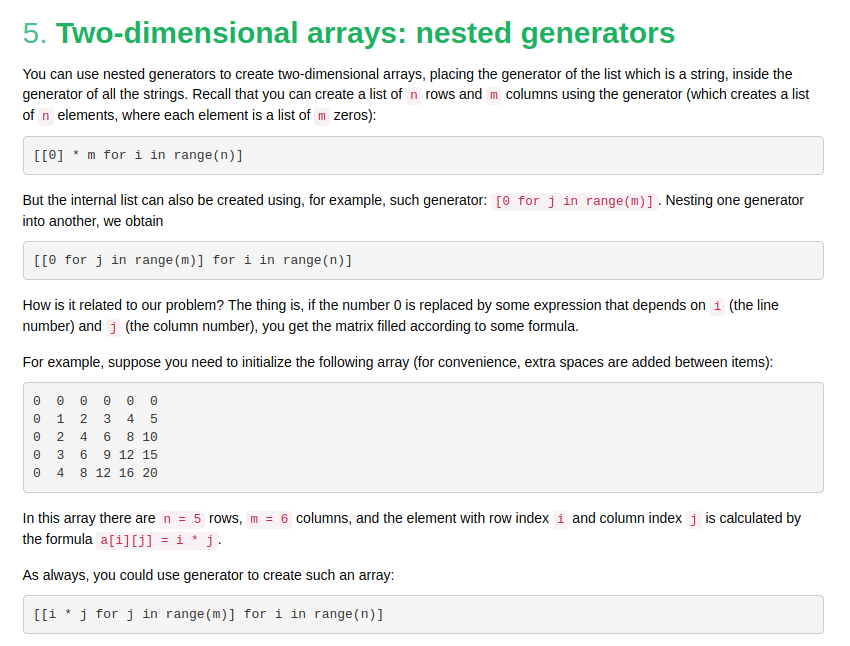

## Nested lists: creating

in `C++` we use `dp[n][m]` to declare an array of `n x m` size 

in python we can do this `dp[[0]*m]*n`

but there is a simple way to create this:
```python3
n = 12
m = 10

dp = [[0]*m in range (n)]

```

## How do you input a two-dimensional array?

Say, a program takes on input two-dimensional array in the form of n rows, each of which contains m numbers separated by spaces. How do you force the program to read it? An example of how you can do it:

```python3
# the first line of input is the number of rows of the array
n = int(input()) 
a = []
for i in range(n):
    a.append([int(j) for j in input().split()])
```

Or, without using sophisticated nested calls:

```python3
# the first line of input is the number of rows of the array
n = int(input()) 
a = []
for i in range(n):
    row = input().split()
    for i in range(len(row)):
        row[i] = int(row[i])
    a.append(row)
```

You can do the same with generators:

```python3
# the first line of input is the number of rows of the array
n = int(input()) 
a = [[int(j) for j in input().split()] for i in range(n)]
```


